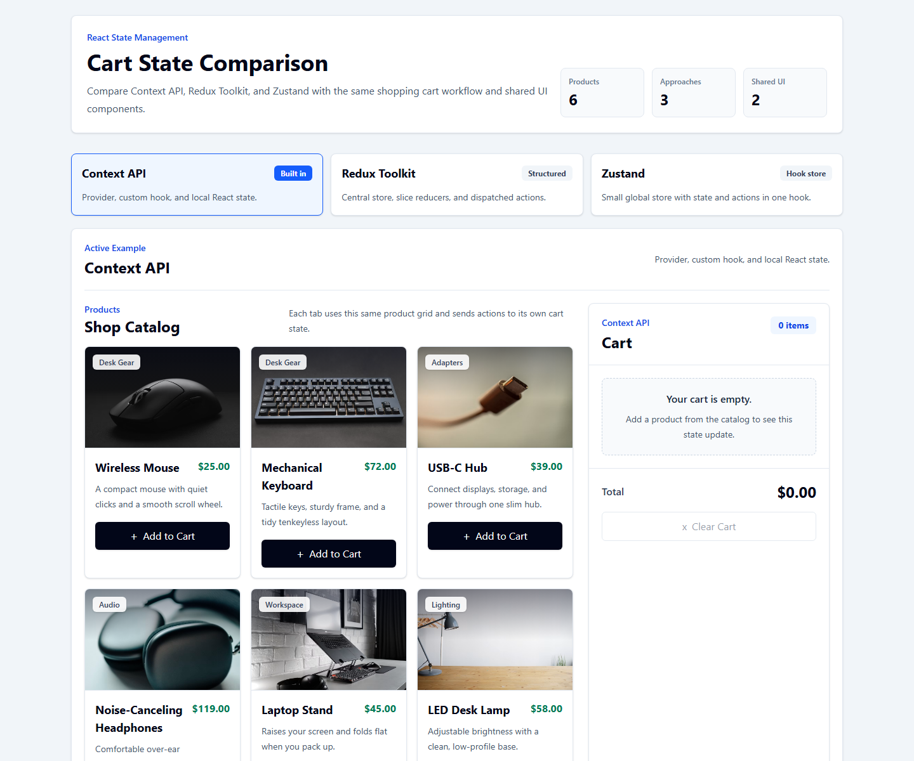

# React State Management Comparison

A React and Tailwind CSS project comparing Context API, Redux Toolkit, and Zustand using the same shopping cart feature.

## Screenshot



## Run Locally

```bash
npm install
npm run dev
```

## What It Demonstrates

- Context API with a provider and custom hook
- Redux Toolkit with a slice and store
- Zustand with a hook-based store
- Shared product and cart components across all three approaches
